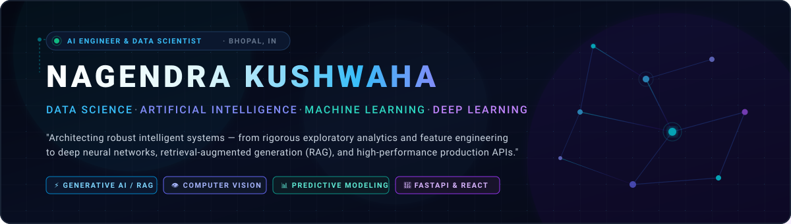
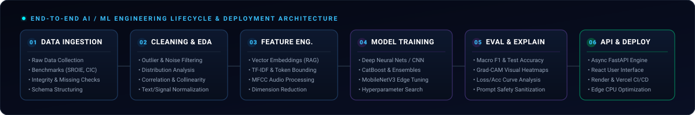

<div align="center">

  

  <br />

  <p align="center">
    <a href="https://my-portfolio-omega-tawny-37.vercel.app"></a>
    <a href="https://www.linkedin.com/in/nagendra-kushwaha-165ba2296/"></a>
    <a href="mailto:shibbuk707@gmail.com"></a>
    <a href="https://github.com/Nagendrakushwaha"></a>
  </p>

  <p align="center">
    <b>📍 Bhopal, Madhya Pradesh, India &nbsp;•&nbsp; 🎓 B.Tech CSE (2023–2027) &nbsp;•&nbsp; ⚡ Open to AI/ML & Data Science Opportunities</b>
  </p>

  <p align="center">
    <a href="#-about-me">About</a> •
    <a href="#-what-i-build">Specializations</a> •
    <a href="#-featured-projects">Featured Projects</a> •
    <a href="#-data--model--deployment-architecture">Architecture</a> •
    <a href="#-technical-stack">Tech Stack</a> •
    <a href="#-how-i-build--engineering-workflow">Workflow</a> •
    <a href="#-experience--learning-journey">Experience</a> •
    <a href="#-lets-connect">Connect</a>
  </p>

</div>


## 🧑‍💻 About Me

I am a **Data Scientist & AI/ML Engineer** pursuing my B.Tech in Computer Science and Engineering at Sam Global University (2023–2027, CGPA: 7.85/10). 

My engineering focus centers on building **practical, mathematically grounded intelligent systems** that bridge the gap between statistical modeling and production deployment. Rather than treating machine learning as a black box, I prioritize:
- **Disciplined Data Engineering**: Rigorous exploratory data analysis (EDA), statistical validation, outlier handling, and signal/text preprocessing.
- **Architectural Depth**: Designing and benchmarking deep learning models (CNNs, MobileNetV3), tree ensembles (CatBoost, XGBoost), and Transformer-based NLP pipelines.
- **Explainability & Safety**: Implementing Grad-CAM visual heatmaps, confidence-calibrated human escalation, prompt-injection sanitization, and PII masking.
- **Production Readiness**: Packaging models into high-concurrency **FastAPI** inference microservices with clean client interfaces.

---

## 🎯 What I Build

<table>
  <tr>
    <td width="50%" valign="top">
      <h3>📊 Data Science &amp; Predictive Analytics</h3>
      <ul>
        <li><b>Exploratory Data Analysis (EDA)</b>: Multicollinearity analysis, distribution inspection, and statistical feature testing.</li>
        <li><b>Feature Engineering</b>: Target encoding, temporal aggregations, signal transformations, and dimensionality reduction.</li>
        <li><b>Predictive Modeling</b>: Supervised regression, time-series demand forecasting, and promotional impact analysis.</li>
        <li><b>Business Intelligence</b>: Actionable visual exploration using Pandas, Seaborn, Matplotlib, and Power BI.</li>
      </ul>
    </td>
    <td width="50%" valign="top">
      <h3>🤖 Machine Learning &amp; Anomaly Detection</h3>
      <ul>
        <li><b>Supervised Classifiers</b>: Gradient-boosted ensembles (CatBoost, XGBoost), Random Forests, and SVMs.</li>
        <li><b>Cybersecurity &amp; Intrusion Detection</b>: Large-scale network traffic flow analysis, DDoS, PortScan, and anomaly classification.</li>
        <li><b>Recommendation Systems</b>: Pairwise cosine similarity and TF-IDF vector space embeddings for personalized discovery.</li>
        <li><b>Spam &amp; Fraud Prevention</b>: Probabilistic text filtering with Naive Bayes and ensemble voting.</li>
      </ul>
    </td>
  </tr>
  <tr>
    <td width="50%" valign="top">
      <h3>🧠 Deep Learning &amp; Computer Vision</h3>
      <ul>
        <li><b>Multimodal Document AI</b>: OCR token extraction, spatial 2D bounding-box modeling on the ICDAR SROIE benchmark.</li>
        <li><b>Neural Vision Backbones</b>: Custom CNN architectures and lightweight MobileNetV3-Small networks.</li>
        <li><b>Explainable AI (XAI)</b>: Grad-CAM visual saliency heatmaps to inspect neural activation decisions.</li>
        <li><b>Edge Optimization</b>: CPU latency profiling and model optimization tailored for standard compute environments.</li>
      </ul>
    </td>
    <td width="50%" valign="top">
      <h3>💬 NLP &amp; Conversational Generative AI</h3>
      <ul>
        <li><b>Fine-Grained Intent Recognition</b>: 77-class classification on the competitive Banking77 benchmark.</li>
        <li><b>Retrieval-Augmented Generation (RAG)</b>: Dense vector retrieval over chunked policy documents.</li>
        <li><b>Multi-Tier AI Safety</b>: Pattern-based prompt-injection defense and automated PII/credential redaction.</li>
        <li><b>Reliable Routing</b>: Softmax confidence thresholding with automated human agent handoff.</li>
      </ul>
    </td>
  </tr>
</table>


## 🌟 Featured Projects

Here are selected real-world AI/ML systems I have built, benchmarked, and documented:

### 1. ShopEase — Customer Support Conversational AI
> **Enterprise Conversational AI with Fine-Grained Intent Classification, Grounded Policy RAG & Security Guardrails**

<table>
  <tr>
    <td>
      <p><b>Problem:</b> Customer service chatbots frequently fail on fine-grained queries, hallucinate company policies, leak sensitive user credentials/PII, and are vulnerable to prompt injection exploits.</p>
      <p><b>Approach:</b> Built a multi-stage conversational AI system combining a 77-class intent classifier on the Banking77 benchmark, semantic vector retrieval across 14 enterprise policy documents (102 chunks), multi-tier regex/embedding safety sanitizers, and confidence-based human escalation.</p>
      <p><b>Verified Metrics:</b></p>
      <ul>
        <li><b>88.72% Test Accuracy</b> across 77 intent categories on the Banking77 benchmark (3,080 test queries)</li>
        <li><b>88.76% Macro F1 Score</b> confirming robust generalization across both common and rare intents</li>
        <li><b>91.20% Policy Retrieval Accuracy</b> across 102 indexed vector chunks</li>
      </ul>
      <p>
        
        
        
        
        
        
      </p>
      <p>
        <a href="https://github.com/Nagendrakushwaha/customer_support_AI"><b>📂 View GitHub Repository</b></a> &nbsp;|&nbsp;
        <a href="https://customer-support-ai-6.onrender.com/"><b>🚀 Live Production Demo</b></a>
      </p>
    </td>
  </tr>
</table>

---

### 2. Cognivision AI — Multimodal Document Intelligence
> **Multimodal Document AI combining OCR spatial geometry, CNN backbones, and Grad-CAM visual interpretability**

<table>
  <tr>
    <td>
      <p><b>Problem:</b> Real-world financial documents, invoices, and receipts exhibit skewed scans, irregular typography, non-standard layouts, and strict inference latency constraints on standard CPU devices.</p>
      <p><b>Approach:</b> Built a multimodal pipeline coupling OCR token recognition and 2D bounding boxes with visual representations from MobileNetV3-Small and custom CogniNet-CNN. Implemented Grad-CAM visual saliency heatmaps to explain model focus and optimized inference latency for AMD Ryzen 5 5500U CPUs.</p>
      <p><b>Key Highlights:</b></p>
      <ul>
        <li>Evaluated on the standard <b>ICDAR SROIE</b> receipt and invoice dataset</li>
        <li>Integrated <b>Grad-CAM</b> explainability maps to visually audit neural attention on document regions</li>
        <li>Dual architecture benchmark: lightweight <b>MobileNetV3-Small</b> vs. specialized <b>CogniNet-CNN</b></li>
      </ul>
      <p>
        
        
        
        
        
        
      </p>
      <p>
        <a href="https://github.com/Nagendrakushwaha/Cognivision-AI"><b>📂 View GitHub Repository</b></a>
      </p>
    </td>
  </tr>
</table>

---

### 3. AI-Powered Network Intrusion Detection System (NIDS)
> **Deep Learning & Gradient-Boosted Cyber Threat Detection on CIC-IDS2017 Traffic PCAPs**

<table>
  <tr>
    <td>
      <p><b>Problem:</b> Modern enterprise networks face dynamic cyber attack vectors (DDoS, Port Scanning, Infiltration, Web Attacks) that easily bypass traditional rule-based firewalls.</p>
      <p><b>Approach:</b> Engineered an end-to-end network intrusion detection pipeline on raw multi-day network traffic from the CIC-IDS2017 benchmark. Built and tuned a custom multi-layer Artificial Neural Network (ANN) with batch normalization and dropout, benchmarking against CatBoost and tree ensembles.</p>
      <p><b>Key Highlights:</b></p>
      <ul>
        <li>Processed real network flows across multiple traffic days (Friday DDoS &amp; PortScan, Thursday Web Attacks, Wednesday Infiltration)</li>
        <li>Visualized complete loss convergence, training/validation accuracy trajectories, and confusion matrices</li>
        <li>Saved production-ready neural weights (<code>best_ann_model.keras</code>) alongside ensemble models</li>
      </ul>
      <p>
        
        
        
        
        
      </p>
      <p>
        <a href="https://github.com/Nagendrakushwaha/AI-Powered-Network-Intrusion-Detection-System"><b>📂 View GitHub Repository</b></a>
      </p>
    </td>
  </tr>
</table>

---

### 4. Speech English Emotion Detection Engine
> **Acoustic Audio Signal Feature Extraction & Deep Learning for Human Emotional State Classification**

<table>
  <tr>
    <td>
      <p><b>Problem:</b> Human conversational interfaces and customer contact centers struggle to detect emotional escalation, stress, or frustration from voice cues in real time.</p>
      <p><b>Approach:</b> Built a full-stack audio signal processing and classification engine. Extracted Mel-Frequency Cepstral Coefficients (MFCCs), Chroma, and Mel-scale spectrogram representations from raw English speech audio, feeding deep neural networks to accurately classify human affective states.</p>
      <p>
        
        
        
        
        
      </p>
      <p>
        <a href="https://github.com/Nagendrakushwaha/speech_english_emotion_detection"><b>📂 View GitHub Repository</b></a>
      </p>
    </td>
  </tr>
</table>

---

### 5. Retail Sales Prediction & Demand Forecasting
> **Supervised Regression & Time-Series Feature Engineering for Retail Inventory Optimization**

<table>
  <tr>
    <td>
      <p><b>Problem:</b> Inaccurate sales forecasts in retail operations cause costly supply-chain disruptions, inventory holding waste, and stockout penalties.</p>
      <p><b>Approach:</b> Conducted structured exploratory analysis across historical retail records. Engineered temporal features (seasonality, holiday flags, rolling windows, promo indicators), handled multicollinearity, and built supervised regression pipelines using Scikit-Learn and ensemble regressors.</p>
      <p>
        
        
        
        
        
      </p>
      <p>
        <a href="https://github.com/Nagendrakushwaha/Retail_Sales_prediction"><b>📂 View GitHub Repository</b></a>
      </p>
    </td>
  </tr>
</table>

---

### 6. Content-Based Movie Recommendation Engine
> **Vector Space NLP Modeling & Pairwise Cosine Similarity for Catalog Discovery**

<table>
  <tr>
    <td>
      <p><b>Problem:</b> Entertainment platforms require fast, cold-start-resistant item recommendation without relying on vast user interaction histories.</p>
      <p><b>Approach:</b> Built a content-based recommendation model processing movie metadata (genres, cast, keywords, directors, and narrative overviews). Generated sparse TF-IDF and bag-of-words token representations and computed high-dimensional cosine similarity matrices to retrieve nearest-neighbor recommendations in sub-second response times.</p>
      <p>
        
        
        
        
      </p>
      <p>
        <a href="https://github.com/Nagendrakushwaha/movie-recommendation-system"><b>📂 View GitHub Repository</b></a>
      </p>
    </td>
  </tr>
</table>

---

### 7. SMS & Email Spam Detection Pipeline
> **High-Precision Text Classification Pipeline with Text Wrangling and Statistical Classifiers**

<table>
  <tr>
    <td>
      <p><b>Problem:</b> High volumes of phishing attempts and spam messages compromise digital communication security and user trust.</p>
      <p><b>Approach:</b> Implemented a clean NLP classification workflow: tokenization, stopword removal, stemming, and TF-IDF matrix generation. Evaluated Naive Bayes (MultinomialNB), Logistic Regression, and Support Vector Machines to maximize precision and minimize false positive spam classifications.</p>
      <p>
        
        
        
        
      </p>
      <p>
        <a href="https://github.com/Nagendrakushwaha/Spam_detection"><b>📂 View GitHub Repository</b></a>
      </p>
    </td>
  </tr>
</table>


## 📐 Data → Model → Deployment Architecture

Understanding and executing the full end-to-end Machine Learning Lifecycle is central to my work:



<br />

```
  ┌─────────────────┐      ┌─────────────────┐      ┌─────────────────┐
  │  RAW DATA &     │ ───► │  DATA WRANGLING │ ───► │  FEATURE        │
  │  BENCHMARKS     │      │  & EXPLORATION  │      │  ENGINEERING    │
  └─────────────────┘      └─────────────────┘      └─────────────────┘
                                                             │
  ┌─────────────────┐      ┌─────────────────┐               │
  │  FASTAPI &      │ ◄─── │  EVALUATION &   │ ◄─────────────┘
  │  PRODUCTION API │      │  EXPLAINABILITY │      │  MODEL TRAINING │
  └─────────────────┘      └─────────────────┘      │  & TUNING       │
           │                                        └─────────────────┘
           ▼
  ┌──────────────────────────────────────────┐
  │  CONTINUOUS MONITORING & HUMAN ROUTING   │
  └──────────────────────────────────────────┘
```


## 🛠️ Technical Stack

All technologies listed below are directly grounded in my active projects and verified codebase:

<div align="left">

### 💻 Core Languages
<p>
  
  
  
  
  
</p>

### 📊 Data Science & Exploratory Analytics
<p>
  
  
  
  
  
  
  
</p>

### 🤖 Machine Learning Frameworks & Algorithms
<p>
  
  
  
  
  
</p>

### 🧠 Deep Learning, Computer Vision & Audio
<p>
  
  
  
  
  
  
</p>

### 💬 NLP & Generative AI Systems
<p>
  
  
  
  
  
  
</p>

### 🚀 Backend, Cloud & Development Tools
<p>
  
  
  
  
  
  
  
</p>

</div>


## 🔬 How I Build — Engineering Principles

```
01 · FORMULATE THE OBJECTIVE
     Define concrete operational metrics (e.g. Macro F1, False Positive Rate, Latency targets) rather than vague goals.

02 · AUDIT & CLEAN THE DATA
     Verify distributions, address imbalance, isolate outliers, and validate feature integrity before touching a model.

03 · CONSTRUCT A BASELINE FIRST
     Build a lean statistical or linear baseline to establish a benchmark that complex models must demonstrably beat.

04 · ARCHITECT & TRAIN SYSTEMATICALLY
     Select suitable representations (dense embeddings, spatial tokens, audio MFCCs), calibrate hyperparameters, and prevent leakage.

05 · RIGOROUS MULTI-METRIC EVALUATION
     Measure precision, recall, and class-level performance; evaluate errors with Grad-CAM and confusion matrices.

06 · ENGINEER ROBUST INFERENCE APIS
     Wrap models in asynchronous FastAPI services with schema validation, PII redaction, and prompt sanitization.

07 · DEPLOY & OBSERVE
     Host on stable cloud infrastructure with clear fallback thresholds and confidence-based human routing.
```


## 🎓 Experience & Learning Journey

<table>
  <thead>
    <tr>
      <th align="left">Timeline / Role</th>
      <th align="left">Organization</th>
      <th align="left">Key Contributions &amp; Applied Focus</th>
    </tr>
  </thead>
  <tbody>
    <tr>
      <td><b>2023 – 2027</b><br /><sub>B.Tech Degree</sub></td>
      <td><b>Sam Global University</b><br /><sub>Bhopal, MP, India</sub></td>
      <td>
        • <b>B.Tech in Computer Science &amp; Engineering</b> (CGPA: <b>7.85 / 10</b>)<br />
        • Rigorous academic grounding in Algorithms, Data Structures, Linear Algebra, Probability, and Neural Networks.<br />
        • Focused project-based learning in applied Machine Learning, Deep Learning, and Cloud Architectures.
      </td>
    </tr>
    <tr>
      <td><b>Data Analytics Intern</b><br /><sub>Internship</sub></td>
      <td><b>UptoSkill</b></td>
      <td>
        • Performed exploratory data analysis and statistical aggregations on complex real-world datasets.<br />
        • Cleaned missing and corrupted entries; extracted actionable operational insights and KPI summaries.
      </td>
    </tr>
    <tr>
      <td><b>Data Science Experience</b><br /><sub>Virtual Experience Program</sub></td>
      <td><b>Boston Consulting Group (BCG)</b></td>
      <td>
        • Completed customer churn diagnostic analysis and predictive modeling for business retention strategy.<br />
        • Engineered domain-specific features, evaluated classifier trade-offs, and documented findings (<a href="https://github.com/Nagendrakushwaha/BCG_Task"><code>BCG_Task</code></a>).
      </td>
    </tr>
    <tr>
      <td><b>Data Science Intern</b><br /><sub>Virtual Internship</sub></td>
      <td><b>CodSoft</b></td>
      <td>
        • Executed supervised machine learning pipelines, regression benchmarks, and classification tasks (<a href="https://github.com/Nagendrakushwaha/codsoft_task-2"><code>codsoft_task-2</code></a>).
      </td>
    </tr>
  </tbody>
</table>

---

## 🔭 Currently Exploring

To continuously sharpen my technical depth, I am actively experimenting with:
- 🧠 **Advanced RAG Patterns**: Hybrid sparse/dense retrieval (BM25 + Cohere/BGE rerankers) and self-reflective query rewriting.
- 🤖 **Autonomous LLM Agents**: Multi-agent workflows with tool-calling, structured JSON outputs, and sandbox execution.
- ⚡ **Model Compression & Quantization**: Post-training quantization (INT8 / FP16) and ONNX Runtime CPU inference acceleration.
- 🔄 **Production MLOps**: Automated training pipelines, experiment tracking with MLflow, and model registry CI/CD.


## 📈 GitHub Analytics & Activity

<div align="center">
  <table border="0">
    <tr>
      <td align="center" width="50%">
        
      </td>
      <td align="center" width="50%">
        
      </td>
    </tr>
  </table>
</div>


## 🤝 Let's Connect & Build

Whether you are looking for an **AI/ML Engineer**, a **Data Scientist**, or a passionate collaborator for impactful machine learning systems, my inbox is open!

<div align="center">

  <p><b>"Building practical intelligent systems from data to deployment."</b></p>

  <p>
    <a href="https://my-portfolio-omega-tawny-37.vercel.app"></a>
    &nbsp;
    <a href="https://www.linkedin.com/in/nagendra-kushwaha-165ba2296/"></a>
    &nbsp;
    <a href="mailto:shibbuk707@gmail.com"></a>
    &nbsp;
    <a href="https://github.com/Nagendrakushwaha"></a>
  </p>

  <p>
    <sub>Open to internships, entry-level Data Science / AI/ML opportunities, and meaningful technical collaborations.</sub>
  </p>

  <p>
    <sub>© Nagendra Kushwaha · Crafted with precision</sub>
  </p>

</div>
