<!-- HEADER BANNER -->
<div align="center">
  
</div>

<div align="center">
  
</div>

---

# 👨‍💻 About Me

## Nagendra Kushwaha

**Data Science & AI Engineer**  
**B.Tech Computer Science & Engineering (2023–2027, CGPA: 7.85/10)**  
**Sam Global University, Bhopal, India**

<p align="center">
  
</p>

---

I enjoy building complete intelligent software systems — from rigorous exploratory analytics, feature engineering, and statistical modeling to deep neural networks, computer vision, and high-performance production FastAPI services.

- 🎓 **Degree / Field:** B.Tech in Computer Science & Engineering (Specialization in Artificial Intelligence & Data Science)
- 🏆 **Achievements:** Designed and benchmarked 30+ machine learning, computer vision, NLP, and data visualization pipelines
- 🎯 **Focus Areas:** Machine Learning, Deep Learning, Generative AI & RAG, Computer Vision, Big Data & Predictive Analytics
- 📬 **Contact:** <a href="mailto:shibbuk707@gmail.com">shibbuk707@gmail.com</a>
-  **WhatsApp:** <a href="https://wa.me/919340058721" target="_blank">Chat on WhatsApp</a>

<!-- SOCIAL / PROFILE BADGES -->
<p align="center">
  <a href="https://www.linkedin.com/in/nagendra-kushwaha-165ba2296/" target="_blank">
    
  </a>
  &nbsp;
  <a href="mailto:shibbuk707@gmail.com">
    
  </a>
  &nbsp;
  <a href="https://github.com/Nagendrakushwaha" target="_blank">
    
  </a>
  &nbsp;
  <a href="https://my-portfolio-omega-tawny-37.vercel.app" target="_blank">
    
  </a>
  <br />
  <a href="https://wa.me/919340058721" target="_blank">
    
  </a>
  &nbsp;
  <a href="https://www.kaggle.com" target="_blank">
    
  </a>
  &nbsp;
  <a href="https://twitter.com" target="_blank">
    
  </a>
</p>

---

## 🚀 Featured Projects

<table>
  <tr>
    <td width="50%" valign="top">
      <h3>🔍 Project 1: ShopEase — Customer Support Conversational AI</h3>
      <p>An enterprise multi-stage conversational AI system combining a 77-class intent classifier on the Banking77 benchmark, semantic vector retrieval across 14 enterprise policy documents (102 chunks), multi-tier prompt injection defense, and confidence-calibrated human agent escalation.</p>
      <ul>
        <li><b>88.72% Test Accuracy</b> across 77 Banking77 intent categories</li>
        <li><b>91.20% Policy Retrieval Accuracy</b> over indexed vector chunks</li>
        <li>Sub-200ms latency with FastAPI asynchronous microservices</li>
      </ul>
      <p>
        
        
        
        
        
      </p>
      <p>
        <a href="https://github.com/Nagendrakushwaha/customer_support_AI"><b>📂 View GitHub Repository</b></a> &nbsp;|&nbsp;
        <a href="https://customer-support-ai-6.onrender.com/"><b>🚀 Live Production Demo</b></a>
      </p>
    </td>
    <td width="50%" valign="top">
      <h3>🗄️ Project 2: Cognivision AI — Multimodal Document Intelligence</h3>
      <p>A multimodal document processing pipeline coupling OCR token recognition and 2D spatial bounding boxes with visual feature representations from MobileNetV3-Small and specialized CogniNet-CNN backbones. Evaluated on the ICDAR SROIE benchmark with Grad-CAM visual explainability maps.</p>
      <ul>
        <li>Dual architecture benchmark: lightweight <b>MobileNetV3</b> vs. specialized <b>CNN</b></li>
        <li><b>Grad-CAM visual saliency heatmaps</b> to visually audit model attention</li>
        <li>Optimized inference latency tailored for standard compute hardware</li>
      </ul>
      <p>
        
        
        
        
        
      </p>
      <p>
        <a href="https://github.com/Nagendrakushwaha/Cognivision-AI"><b>📂 View GitHub Repository</b></a>
      </p>
    </td>
  </tr>
  <tr>
    <td width="50%" valign="top">
      <h3>🛡️ Project 3: AI-Powered Network Intrusion Detection System (NIDS)</h3>
      <p>An end-to-end cyber threat classification pipeline engineered on multi-day raw network traffic from the CIC-IDS2017 benchmark. Designed a custom Artificial Neural Network (ANN) with batch normalization and dropout, benchmarking against CatBoost and Random Forest tree ensembles.</p>
      <ul>
        <li>Classified dynamic vectors: DDoS, PortScan, Infiltration, Web Attacks</li>
        <li>Visualized complete loss convergence and confusion matrices</li>
        <li>Exported production-ready neural weights (<code>best_ann_model.keras</code>)</li>
      </ul>
      <p>
        
        
        
        
        
      </p>
      <p>
        <a href="https://github.com/Nagendrakushwaha/AI-Powered-Network-Intrusion-Detection-System"><b>📂 View GitHub Repository</b></a>
      </p>
    </td>
    <td width="50%" valign="top">
      <h3>🎙️ Project 4: Speech English Emotion Detection Engine</h3>
      <p>A full-stack acoustic audio signal processing and classification engine. Extracted Mel-Frequency Cepstral Coefficients (MFCCs), Chroma, and Mel-scale spectrogram representations from raw human speech audio, feeding deep neural networks to accurately classify human affective states.</p>
      <ul>
        <li>Multi-feature acoustic extraction with Librosa</li>
        <li>Deep neural classification for real-time contact center intelligence</li>
        <li>FastAPI backend wrapper for low-latency audio file inference</li>
      </ul>
      <p>
        
        
        
        
      </p>
      <p>
        <a href="https://github.com/Nagendrakushwaha/speech_english_emotion_detection"><b>📂 View GitHub Repository</b></a>
      </p>
    </td>
  </tr>
  <tr>
    <td width="50%" valign="top">
      <h3>📊 Project 5: Retail Sales Prediction & Demand Forecasting</h3>
      <p>Supervised regression and time-series feature engineering across multi-store retail records. Engineered temporal features (rolling moving averages, seasonality, promo indicators), resolved multicollinearity, and built predictive models for supply-chain inventory optimization.</p>
      <p>
        
        
        
        
      </p>
      <p>
        <a href="https://github.com/Nagendrakushwaha/Retail_Sales_prediction"><b>📂 View GitHub Repository</b></a>
      </p>
    </td>
    <td width="50%" valign="top">
      <h3>🎬 Project 6: Content-Based Movie Recommendation Engine</h3>
      <p>High-dimensional vector space discovery engine processing movie catalog metadata (genres, cast, keywords, overviews). Computes pairwise cosine similarity matrices across TF-IDF token representations for sub-second nearest-neighbor item retrieval.</p>
      <p>
        
        
        
        
      </p>
      <p>
        <a href="https://github.com/Nagendrakushwaha/movie-recommendation-system"><b>📂 View GitHub Repository</b></a>
      </p>
    </td>
  </tr>
</table>

---

## 🛠️ Tech Stack

**Languages**
<p>
  
  
  
  
  
  
</p>

**Data Science & Exploratory Analytics**
<p>
  
  
  
  
  
  
  
</p>

**AI & Machine Learning Frameworks**
<p>
  
  
  
  
  
</p>

**Deep Learning, Vision & Audio**
<p>
  
  
  
  
  
  
</p>

**NLP & Generative AI Systems**
<p>
  
  
  
  
  
  
</p>

**Backend, Cloud & Development Tools**
<p>
  
  
  
  
  
  
  
</p>

---

## 📊 GitHub Stats & Live Contributions

<div align="center">
  <!-- Interactive Animated Cyberpunk Overview Dashboard -->
  <a href="https://github.com/Nagendrakushwaha" target="_blank">
    
  </a>
</div>

<br />

<!-- Real-time Live GitHub Contribution Cards -->
<div align="center">
  <table border="0" width="100%" style="border-collapse: collapse; border: none;">
    <tr style="border: none;">
      <td width="50%" align="center" style="border: none; padding: 6px;">
        <a href="https://github.com/Nagendrakushwaha" target="_blank">
          
        </a>
      </td>
      <td width="50%" align="center" style="border: none; padding: 6px;">
        <a href="https://github.com/Nagendrakushwaha" target="_blank">
          
        </a>
      </td>
    </tr>
    <tr style="border: none;">
      <td colspan="2" align="center" style="border: none; padding: 6px;">
        <a href="https://github.com/Nagendrakushwaha" target="_blank">
          
        </a>
      </td>
    </tr>
  </table>
  <p align="center">
    <a href="https://github.com/Nagendrakushwaha?tab=overview" target="_blank">
      
    </a>
  </p>
</div>

---

## 💻 Spent My Time

<div align="center">
  
</div>

<br />

<div align="center">
  <p><b>14 Certificates &nbsp;|&nbsp; 5 Learning Tracks &nbsp;|&nbsp; 30+ ML &amp; Data Projects</b></p>
</div>

---

## 📐 Data → Model → Deployment Architecture

```
  ┌─────────────────┐      ┌─────────────────┐      ┌─────────────────┐
  │  RAW DATA &     │ ───► │  DATA WRANGLING │ ───► │  FEATURE        │
  │  BENCHMARKS     │      │  & EXPLORATION  │      │  ENGINEERING    │
  └─────────────────┘      └─────────────────┘      └─────────────────┘
                                                             │
  ┌─────────────────┐      ┌─────────────────┐               │
  │  FASTAPI &      │ ◄─── │  EVALUATION &   │ ◄─────────────┘
  │  PRODUCTION API │      │  EXPLAINABILITY │      │  MODEL TRAINING │
  └─────────────────┘      └─────────────────┘      │  & TUNING       │
           │                                        └─────────────────┘
           ▼
  ┌──────────────────────────────────────────┐
  │  CONTINUOUS MONITORING & HUMAN ROUTING   │
  └──────────────────────────────────────────┘
```

---

## 🎓 Education & Experience

<table>
  <thead>
    <tr>
      <th align="left">Timeline / Role</th>
      <th align="left">Organization</th>
      <th align="left">Key Contributions &amp; Applied Focus</th>
    </tr>
  </thead>
  <tbody>
    <tr>
      <td><b>2023 – 2027</b><br /><sub>B.Tech Degree</sub></td>
      <td><b>Sam Global University</b><br /><sub>Bhopal, MP, India</sub></td>
      <td>
        • <b>B.Tech in Computer Science &amp; Engineering</b> (CGPA: <b>7.85 / 10</b>)<br />
        • Rigorous academic grounding in Algorithms, Data Structures, Linear Algebra, Probability, and Neural Networks.<br />
        • Focused project-based learning in applied Machine Learning, Deep Learning, and Cloud Architectures.
      </td>
    </tr>
    <tr>
      <td><b>Data Analytics Intern</b><br /><sub>Internship</sub></td>
      <td><b>UptoSkill</b></td>
      <td>
        • Performed exploratory data analysis and statistical aggregations on complex real-world datasets.<br />
        • Cleaned missing and corrupted entries; extracted actionable operational insights and KPI summaries.
      </td>
    </tr>
    <tr>
      <td><b>Data Science Experience</b><br /><sub>Virtual Experience Program</sub></td>
      <td><b>Boston Consulting Group (BCG)</b></td>
      <td>
        • Completed customer churn diagnostic analysis and predictive modeling for business retention strategy.<br />
        • Engineered domain-specific features, evaluated classifier trade-offs, and documented findings (<a href="https://github.com/Nagendrakushwaha/BCG_Task"><code>BCG_Task</code></a>).
      </td>
    </tr>
    <tr>
      <td><b>Data Science Intern</b><br /><sub>Virtual Internship</sub></td>
      <td><b>CodSoft</b></td>
      <td>
        • Executed supervised machine learning pipelines, regression benchmarks, and classification tasks (<a href="https://github.com/Nagendrakushwaha/codsoft_task-2"><code>codsoft_task-2</code></a>).
      </td>
    </tr>
  </tbody>
</table>

---

## 🤝 Let's Connect & Build

Whether you are looking for a **Data Scientist**, an **AI/ML Engineer**, or a passionate collaborator for impactful machine learning systems, my inbox is open!

<div align="center">

  <p><b>"Building practical intelligent systems from data to deployment."</b></p>

  <p>
    <a href="https://my-portfolio-omega-tawny-37.vercel.app"></a>
    &nbsp;
    <a href="https://www.linkedin.com/in/nagendra-kushwaha-165ba2296/"></a>
    &nbsp;
    <a href="mailto:shibbuk707@gmail.com"></a>
    &nbsp;
    <a href="https://github.com/Nagendrakushwaha"></a>
  </p>

  <p>
    <sub>Open to internships, entry-level Data Science / AI/ML opportunities, and meaningful technical collaborations.</sub>
  </p>

  <p>
    <sub>© Nagendra Kushwaha · Crafted with precision</sub>
  </p>

</div>
